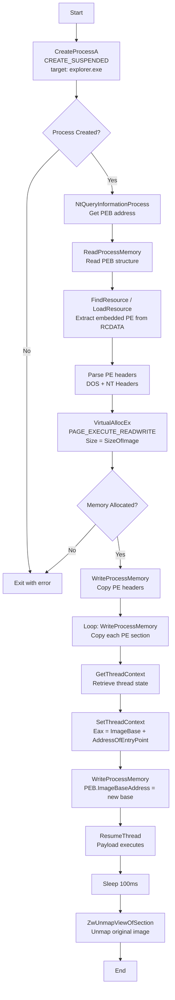

# Process Hollowing: PE Manual Mapping with PEB Modification

## Technique

**MITRE ATT&CK:** T1055.012 - Process Hollowing

## Description

This PoC demonstrates "evasive" process hollowing by manually mapping a PE executable into a suspended process, modifying the PEB's ImageBaseAddress to point to the injected image, hijacking execution via thread context manipulation, and then unmapping the original image section to complete the hollowing.

## Execution Flow



### Steps Detail

| Step | API Call                           | Description                                       |
| ---- | ---------------------------------- | ------------------------------------------------- |
| 1    | `CreateProcessA(CREATE_SUSPENDED)` | Create target process (explorer.exe) in suspended |
| 2    | `NtQueryInformationProcess`        | Retrieve ProcessBasicInformation (PEB address)    |
| 3    | `ReadProcessMemory`                | Read PEB structure from target process            |
| 4    | `FindResource` / `LoadResource`    | Extract embedded PE payload from RCDATA resource  |
| 5    | Parse PE headers                   | Validate DOS/NT signatures, get SizeOfImage       |
| 6    | `VirtualAllocEx`                   | Allocate RWX memory for injected PE               |
| 7    | `WriteProcessMemory`               | Copy PE headers to allocated memory               |
| 8    | `WriteProcessMemory` (loop)        | Copy each section (.text, .data, etc.)            |
| 9    | `GetThreadContext`                 | Retrieve suspended thread's context               |
| 10   | `SetThreadContext`                 | Set Eax = new entry point address                 |
| 11   | `WriteProcessMemory`               | Overwrite PEB.ImageBaseAddress with new base      |
| 12   | `ResumeThread`                     | Resume execution, payload runs                    |
| 13   | `ZwUnmapViewOfSection`             | Unmap original process image (true hollowing)     |

## Payload Requirements

- Format: **PE executable (.exe)**, not raw shellcode
- Architecture: **x86 (32-bit)** - code uses DWORD casts and Eax register
- Must be a valid PE with proper headers and sections
- Embedded in injector's resource section as `RCDATA`

## Usage

```
HollowProcessInjection1.exe
```

No command-line arguments. Target process (`explorer.exe`) and payload are hardcoded.

To change payload: edit `HollowProcessInjection.rc` and update the RCDATA path.

## Key Differences from Classic Hollowing

| Aspect               | This PoC                         | Classic Hollowing              |
| -------------------- | -------------------------------- | ------------------------------ |
| Allocation address   | Any available address (NULL)     | Original ImageBase (preferred) |
| PEB modification     | ✅ Yes - spoofs ImageBaseAddress | Sometimes                      |
| Original image unmap | ✅ Yes - after ResumeThread      | Before injection               |
| Timing of unmap      | Post-execution (evasive)         | Pre-injection                  |

## IOCs for Detection

- Process spawned with `CREATE_SUSPENDED` flag
- Cross-process `VirtualAllocEx` with `PAGE_EXECUTE_READWRITE`
- Multiple `WriteProcessMemory` calls (headers + sections)
- `NtQueryInformationProcess` for ProcessBasicInformation
- PEB.ImageBaseAddress modified (memory forensics artifact)
- `ZwUnmapViewOfSection` on original image base
- Thread context modification (`SetThreadContext`)
- Eax/Rax pointing to non-original entry point

## Log Sources Coverage

| Data Component                | Log Source                           | Channel/Event                                        | Detected?                     |
| ----------------------------- | ------------------------------------ | ---------------------------------------------------- | ----------------------------- |
| Process Creation (DC0032)     | WinEventLog:Sysmon                   | EventCode=1                                          | ✅ Yes                        |
| Process Access (DC0035)       | WinEventLog:Sysmon                   | EventCode=10                                         | ✅ Yes                        |
| Process Modification (DC0020) | WinEventLog:Sysmon                   | EventCode=8                                          | ❌ No (no CreateRemoteThread) |
| OS API Execution (DC0021)     | etw:Microsoft-Windows-Kernel-Process | VirtualAllocEx, WriteProcessMemory, SetThreadContext | ✅ Yes                        |
| Section Unmap                 | etw:Microsoft-Windows-Kernel-Process | NtUnmapViewOfSection                                 | ✅ Yes                        |

## Memory Forensics Indicators

| Indicator                        | Description                                                   |
| -------------------------------- | ------------------------------------------------------------- |
| PEB.ImageBaseAddress mismatch    | PEB points to injected PE, not original mapped image          |
| VAD with RWX protection          | Suspicious private memory with execute permissions            |
| Hollow process (no file backing) | After unmap, original image region has no file-backed mapping |
| PE headers in private memory     | MZ/PE signature found in non-image VAD region                 |

> **Note:** The delayed `ZwUnmapViewOfSection` (after `ResumeThread`) is an evasion technique - it allows the payload to start executing before the original image is unmapped, potentially bypassing some detection mechanisms that check for unmapping before execution.
