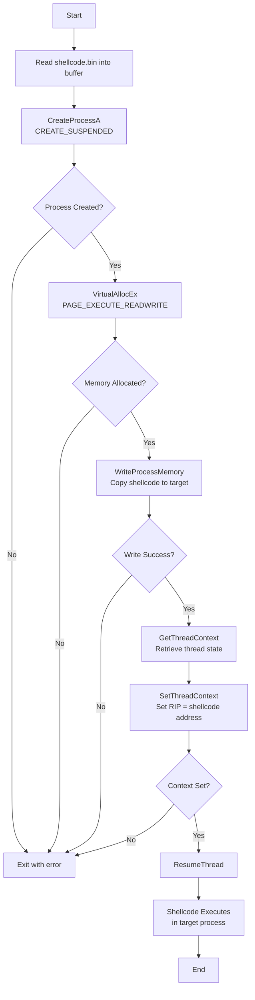

# Hollow64.c - Process Hollowing (Variant)

## Technique

**MITRE ATT&CK:** T1055.012 - Process Hollowing

## Description

This tool injects raw shellcode (.bin) into a newly created suspended process, then hijacks the instruction pointer (RIP) to execute the payload instead of the original process code.

## Execution Flow



### Steps Detail

| Step | API Call                                | Description                               |
| ---- | --------------------------------------- | ----------------------------------------- |
| 1    | `fopen` / `fread`                       | Read shellcode from .bin file into memory |
| 2    | `CreateProcessA(CREATE_SUSPENDED)`      | Create target process in suspended state  |
| 3    | `VirtualAllocEx`                        | Allocate RWX memory in target process     |
| 4    | `WriteProcessMemory`                    | Write shellcode to allocated memory       |
| 5    | `GetThreadContext` / `SetThreadContext` | Redirect RIP to shellcode address         |
| 6    | `ResumeThread`                          | Resume thread, executes shellcode         |

## Payload Requirements

- Format: Raw binary (.bin), not PE
- Architecture: x64 (uses RIP register)
- Position-independent code (PIC)
- Entry point at first byte

## Usage

```
Hollow64.exe <target_process> <shellcode.bin>
```

## IOCs for Detection

- Process spawned with `CREATE_SUSPENDED` + context modification
- Cross-process `VirtualAllocEx` with `PAGE_EXECUTE_READWRITE`
- RIP pointing to unbacked executable memory
- API sequence: CreateProcess → VirtualAllocEx → WriteProcessMemory → SetThreadContext → ResumeThread
